# Smart-Watch
An Arduino powered `SmartWatch` capable of displaying notifications and information onto OLED Screen.

# Overview of Android Application

## View consisting of all notifications and messages
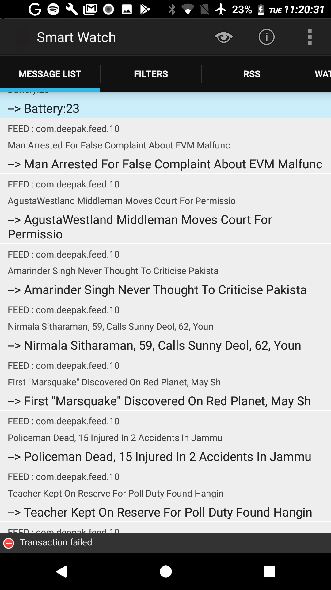
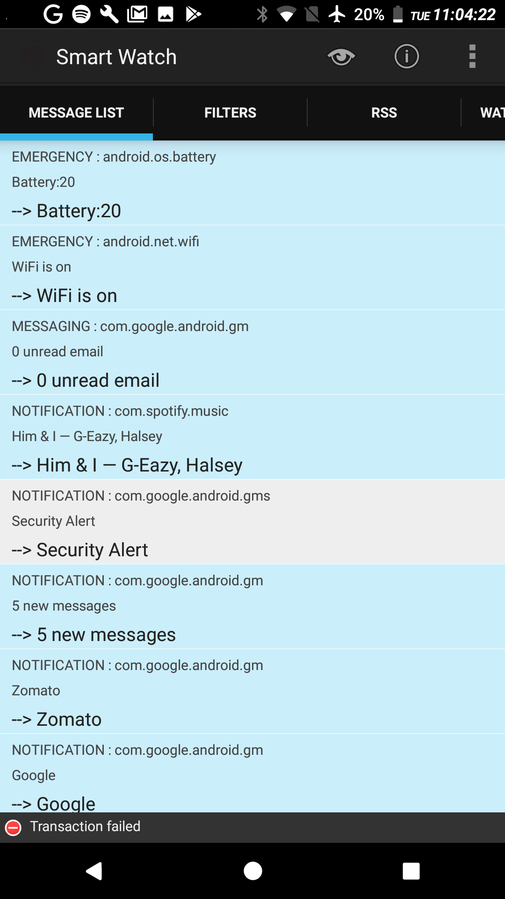

## View consisting of selected messages and fiters (added if necessary)

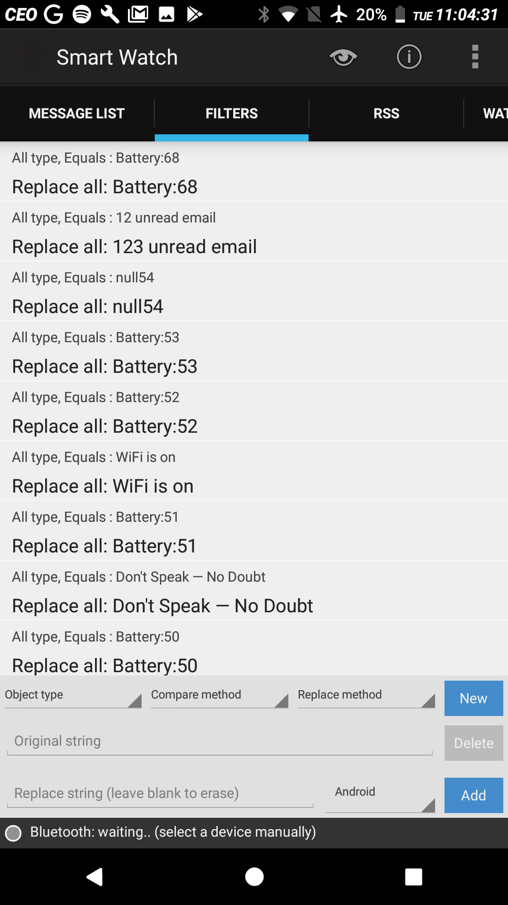

## Connect Bluetooth devices

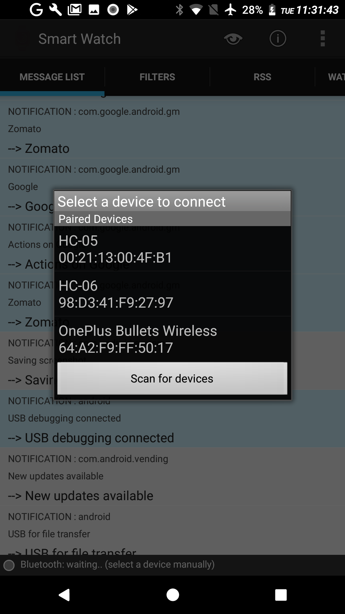

## Change different watch styles

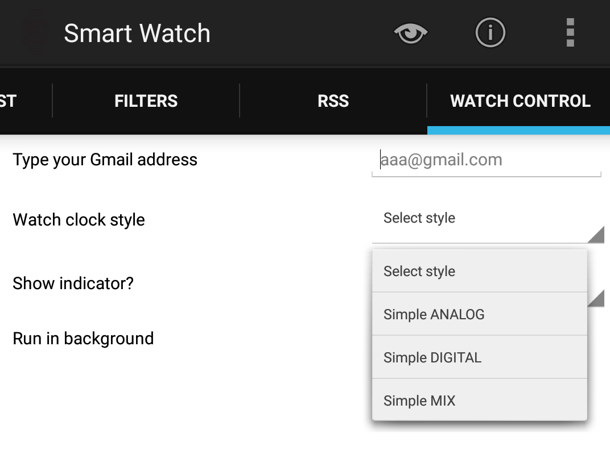

# Overview of Arduino System

## Homescreen 

## WatchFaces

Analog WatchFace

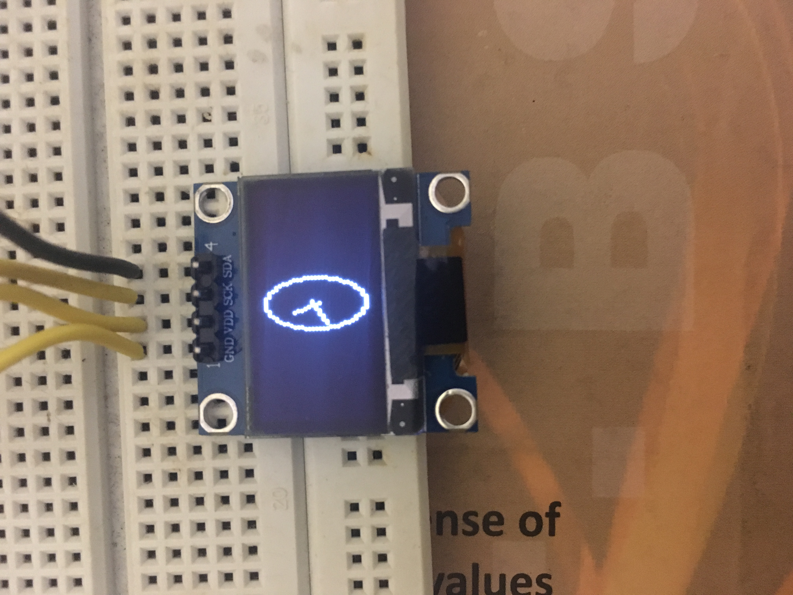

Digital WatchFace

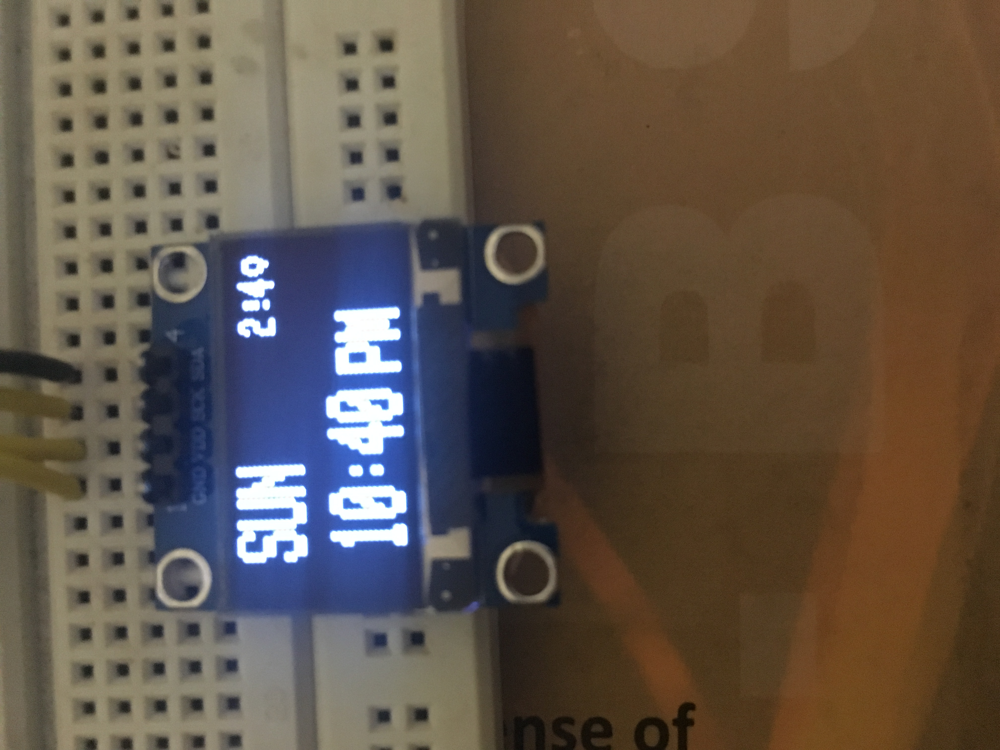

## Notifications on-the-go

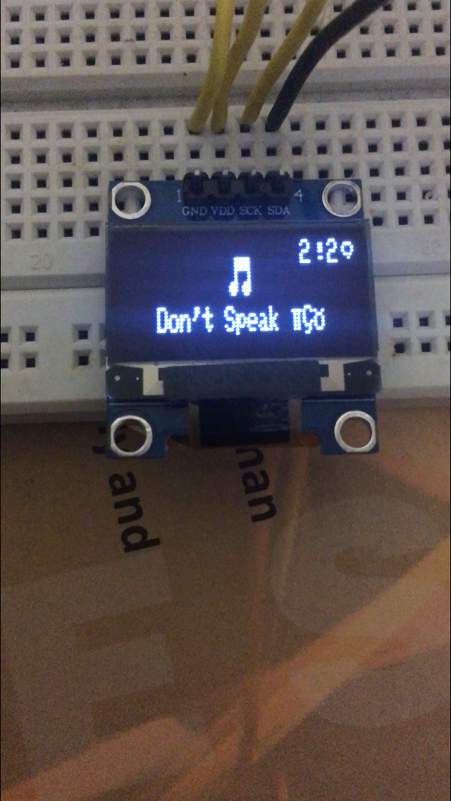
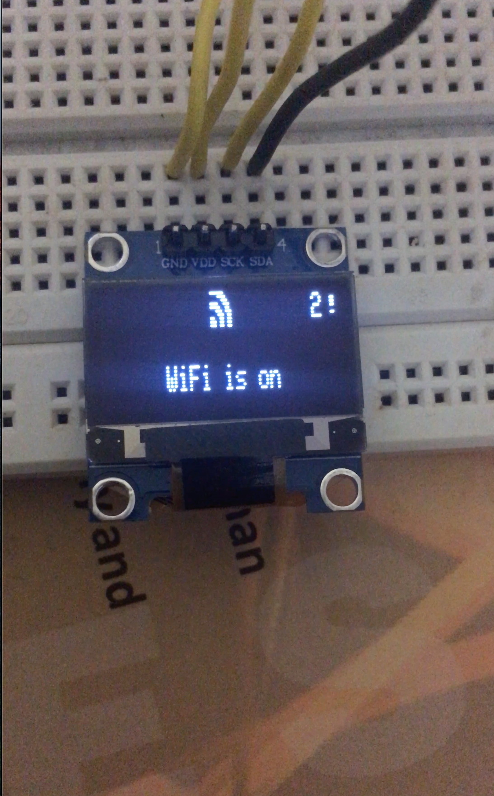
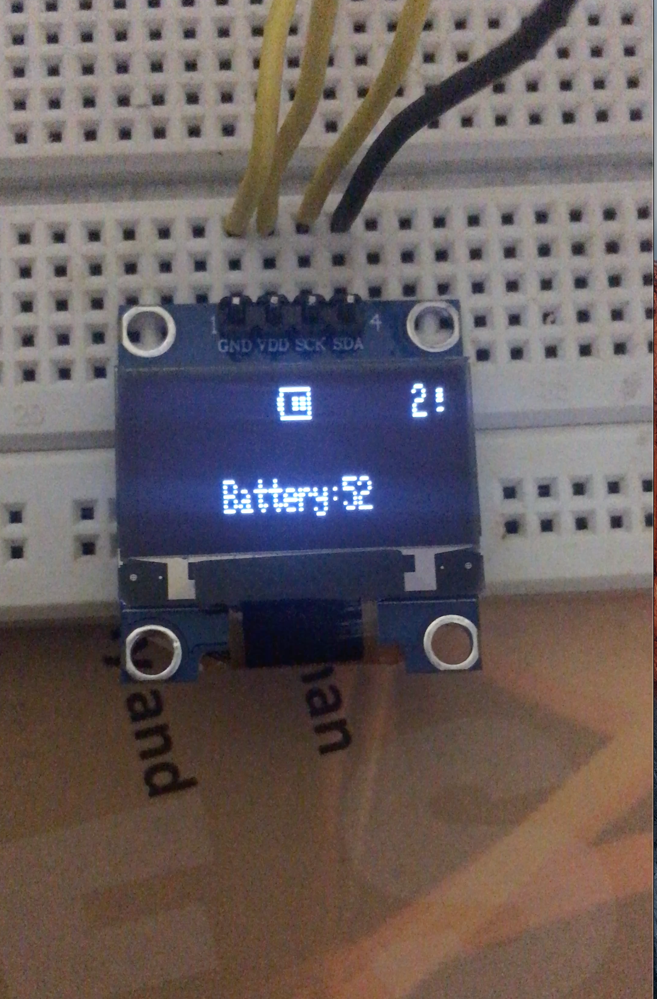

## Screen saver

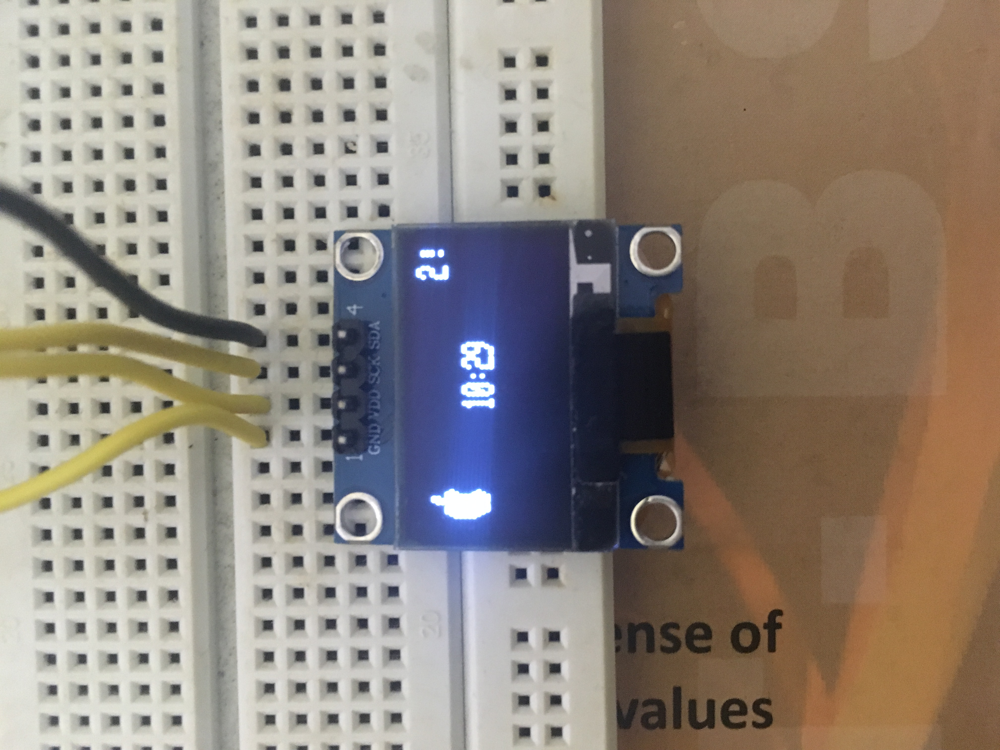
