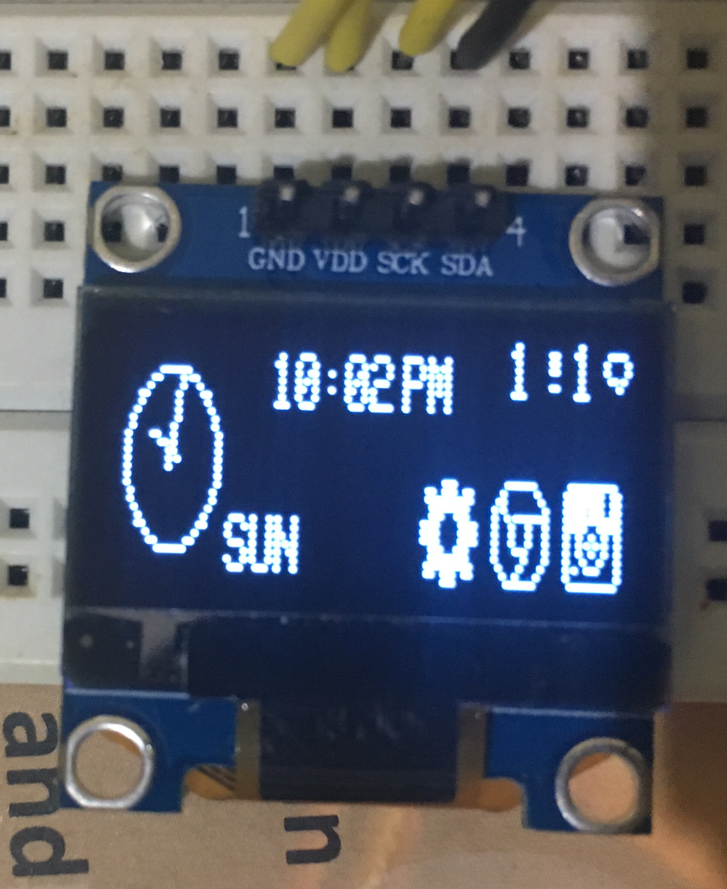

# Smart-Watch
An Arduino powered `SmartWatch` capable of displaying notifications and information onto OLED Screen.

# Overview of Android Application

## View consisting of all notifications and messages

## View consisting of selected messages and fiters (added if necessary)

## Connect Bluetooth devices

## Change different watch styles

# Overview of Arduino System

## Homescreen 

## WatchFaces

Analog WatchFace                                                 Digital WatchFace

    

## Notifications on-the-go

## Screen saver

